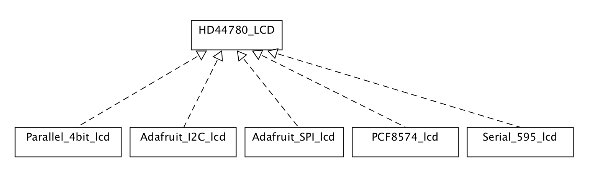
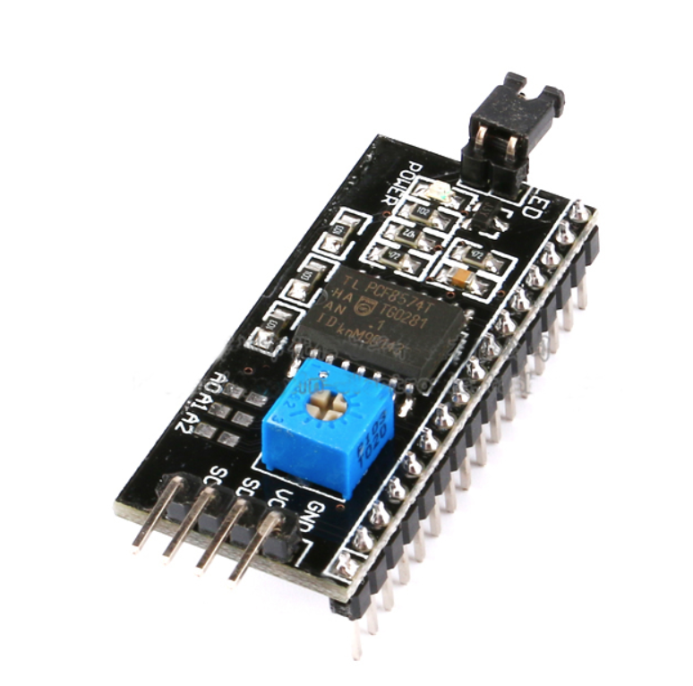
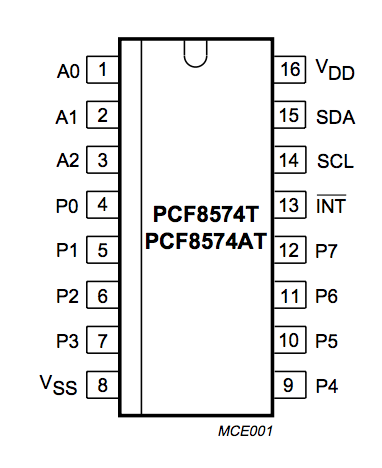

# General Serial LCD Operation
After building a serial to parallel converter, and then owning a couple different I2C kinds I felt I wanted to have my own library that could work consistently across all devices. And not have to install and manage many different but seemingly mostly similar libraries with a little bit of specific modification for that device.

For me, this is what C++ classes and Object Oriented Programming is meant to do.


While learning and figuring things out, I found the following other LCD library for Arduino works to be helpful.

* Adafruit LCD backpack, driven by MCP23008: [Adafruit_LiquidCrystal](https://github.com/adafruit/Adafruit_LiquidCrystal)
  * This extends the Arduino community [LiquidCrystal library](https://github.com/arduino-libraries/LiquidCrystal/blob/master/src/LiquidCrystal.h) ([doc](https://www.arduino.cc/en/Reference/LiquidCrystal))
  * Kind of not sure why they did not just subclass the LiquidCrystal one. They just added a couple functions. But left the parallel operation things, which are never going to be used in this mode.
* Generic LCD backpack, driven by PCF8574: "I2C LCD1602/2004 Adapter Plate" from Ali Express.
  * Another library here: [LiquidCrystal_PCF8574](https://github.com/mathertel/LiquidCrystal_PCF8574)


I started to have the general theory, that I would like the same software interface (using a display buffer), but to support the specific lcd backend technology.

This facilitated extracting an interface of the functions that exist in each library and making a common parent class, that is implemented by each specific library. If there are any specific messaging needed that is.

I chose to not subclass the Arduino LiquidCrystal class, since it has a bunch of fields that only make sense if you are parallel mode.  I guess really for completeness I should define a class to support 4 bit parallel mode here as well.

A first attempt was to create a structure to hold the state for a given LCD
```
struct serial_lcd {
    int pin_ser;        // the pin number on the Arduino that connects to SER (pin 14 of the 74HC595)
    int pin_srclk;      // the pin number on the Arduino that connects to the SRCLK (pin 11 on the 74HC595)
    int pin_rclk;       // the pin number on the Arduino that connects to the RCLK (pin 12 on the 74HC595)
    volatile int data;  // the byte value representing the pin state on the 74HC595
};
```

Then all the functions we had defined in the header require a pointer to this serial_lcd structure. This allows us to have more than one LCD attached to the Arduino and in use at the same time.

This was based on some earlier work I had done to connect a LCD to a USB parallel interface. But it was not very compatible with the Aruduino libraries.

So I rewrote it, to be of the same class packaging, using the same function names.

## Supported Devices and modes
* 4 bit parallel interface (e.g. an Arduino keypad LCD shield)
* Adafruit I2C LCD backpack (both the I2C and SPI modes)
* PCF8574 based I2C to parallel devices, like Ali Express I2C LCD backpacks.
* My own 74HC595 based serial to parallel interface hardware, that was originally the purpose of this project.


# Some LCD Theory
If you ever wanted to understand some of the history, The Hitachi HD44780 controller no longer exists anymore, but there are many compatible following devices.
There are a lot of references everywhere. I recommend taking some time to read up on them, as many people have done a much better job at their documentation than I would. Though it is good to know a bit of things as they apply to what we are doing here.

How to drive a LCD using a Serial to parallel adapter

* Using the 4 bit mode of the standard HD44780 type LCD controller.
* RS pin (register select)
* E pin (enable)
* Variable resistor to adjust contrast.
* Backlight control pin. Optional variable resistor to adjust brightness.
* Power pin

Which is a lot less pins than just using the pins on the device.

There is an initialization chatter that we need to do to set up the display.

This hardware does support a read mode, but we will only consider using it in write-only mode. There is not a compelling need to read from the LCD in our use.


## Operation

All we want to do here is write bits to the LCD.

Where we do this, according to the data sheet,
* Load the value of the data onto the data pins.
* LCD_E is LOW by default. We strobe it to HIGH to make read/write operations. The effect is applied on the *falling* edge of E signal.
* LCD RS is LOW for command operation, HIGH for data operation.


(Wavedrom source for image above)
```
{signal: [
  {name: 'RS', wave: 'x2...x'},
  {name: 'R/W', wave: '20...2'},
  {name: 'E', wave: '0.1.0.'},
  {name: 'DB7-0', wave: '2..2.2', data: ['','Valid Data']}
]}
```

Where for 4 bit operation,
* Load the upper nibble of the data or command byte to the [D4..D7] pins.
* Strobe `E` pin.
* Load the lower nibble of the data or command byte to the [D4..D7] pins.
* Strobe 'E' pin.


### A note about 8 bit parallel mode
Here we are using the 4 bit parallel mode, because it requires fewer pins from the shift register. We require at least of 2 control pins, so if we used 8 bit data mode we would need 2 shift registers to get at least 10 bits.

But when we operate the display in 8 bit mode we just send out the value on the 8 pins and strobe `E` once. So there is perhaps a compelling reason to use 8 bit mode if we wanted to save some timing requirements.

Typically the LCD display will have a hysteresis effect, so updating or moving characters faster than a certain rate will only create a blurrly looking image anyway.

# Hardware Implementations
Here are a few methods that are currently supported by this library.

## LCD driven by a 74HC595

This was inspired by those I2C or SPI LCD backpacks from Adafruit.
And the reason this project here exists.


Only here, well, we just use a 74HC595.

The library requires (3) digital IO pins on your Arduino.

There are some assumptions for how the LCD is connected to the 74HC595, see the
schematic in the doc folder.

For more information about this library please visit us at
https://github.com/marsairforce/595_lcd

### Pin mapping

| 74HC595  | Display  |
|----------|:---------|
| Q7 | D4 |
| Q6 | D5 |
| Q5 | D6 |
| Q4 | D7 |
| Q3 | E |
| Q2 | RS |
| Q1 | Backlight |
| Q0 | LCD VDD |

This works out well, so that we can use shift out with the least significant bit first,
```
shiftOut(lcd->pin_ser, lcd->pin_srclk, LSBFIRST, lcd->data);
```
so in our software if we wanted to write, e.g. a `0x03`, it will be the value on [D4..D7] as it should be.

However, because the data pins are the last bits (higher number) in the shift register,
and the control pins are also in this 8 bit register, the lower down, the data when we view the waveform appears backwards.


Where we can see in the frame ther, the `3B` and then '3C' value, corresponds to
the activity of writing the value `0x0C` to the display, where we have the `E` pin first high,
and then low.

The timing diagram above only shows one nibble, or half of a character or command sequence.

Because we have a pin for the power to the LCD, we can use software to turn the display off entirely. This is a feature that is not present on the other Serial LCD backpacks that I have found so far.

In the software we use a union of a struct of bit fields. This allows us to express a variable directly without needing clutter our code up with inline bit shifting operators everywhere.

### A Use case: Clearing the screen

Lets have a look at the operations that are involved by a single command.


The library provides  a function to clear the display, `void lcd_clear(serial_lcd *lcd)`:
```
void lcd_clear(serial_lcd *lcd) {
  lcd_write(lcd, 0, 0x01);
  delay(2);
}
```

Where lcd_write invokes two nibble write operations. But we have refactored the lcd_write_nibble to remove one cycle of loading the shift register.
So this is now done in 5 cycles. The original was 8.


(Where this low level port write is just digitalWrite and shiftOut opertions):
```
void lcd_port_write(serial_lcd *lcd) {
  shiftOut(lcd->pin_ser, lcd->pin_srclk, LSBFIRST, lcd->data);
  digitalWrite(lcd->pin_rclk, HIGH);
  digitalWrite(lcd->pin_rclk, LOW);
}
```
### Why use a 74HC595
I have and appreciate the I2C LCD backpack. But sometimes I am playing with ATTiny devices,
or something else that does ot have an I2C. I guess I could use the SPI mode on that.

But then sometimes I don't feel like spending $10 USD, which when converted to CDN, plus taxes and shipping
usually comes out to about double.

There are a lot of low price LCD backpacks on Amazon, or AliExpress.
But then I am impatient and don't have them at the moment when I feel like wiring something up on a breadboard,
and it turns out I do have a bunch of 74HC595's. So there is that.

I also thought it is a good learning experience to build something yourself sometimes.

### Hardware

A Kicad project for a circuit board to hold the 74HC595 shift register and the trimmer resistors is in the `backpack` sub folder here.


My board design is on OSHPark here: https://oshpark.com/projects/P1p8G9Nj


## PCF8574
You can get these on Ali Epress in a bunch of them in a lot for a couple dollars a piece.

Really it is cheaper than me buying just the PCF8574 device. And then having to also buy the other components, have a PCB made. I don't know how they do it.

This device works a bit like a 74HC595 from the software perspective. There are no elaborate pin mappings or registers. You just write 8 bits to it and that gets put to the output pins.

Which means if you would like to change the value of one pin you need to write the entire 8 bits again. It is helpful to maintain a state for the varioous control pins.  We did this in our libary using C language struct bit fields.



Mapping to the LCD pins on these devices appears to be as follows:

| PCF8574T | LCD |
| :------- | :-- |
| P0 | RS |
| P1 | RW |
| P2 | E  |
| P3 | BACKLIGHT |
| P4 | D4 (D0) |
| P5 | D5 (D1) |
| P6 | D6 (D2) |
| P7 | D7 (D3) |


## Adafruit I2C LCD Backpack
This product has its own page. They do very well with it. It supports both SPI and I2C modes of operation. It is a generic IO expander, pins can be set to be individually inputs or outputs, like in the Aruino. It is really more qualified than it needs to be for driving an LCD. Something to hack at with another project some time.

I don't mean to sound like an advertisement, it is just a neat device. My only complaint is I would want a way to power off the LCD hardware using software and to control the contrast. Then again no other products do this either I guess.

## Example Sketches
Have a look in the examples folder for sample use of the library.
There are different sketches for each supported hardware device.

