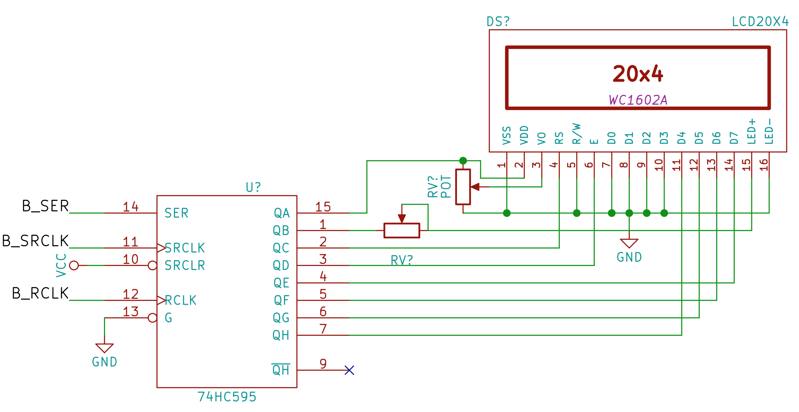
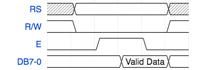
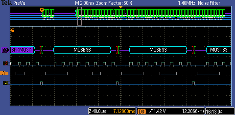
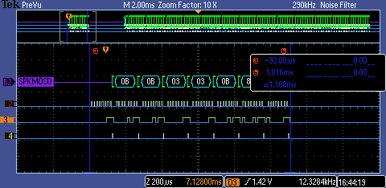
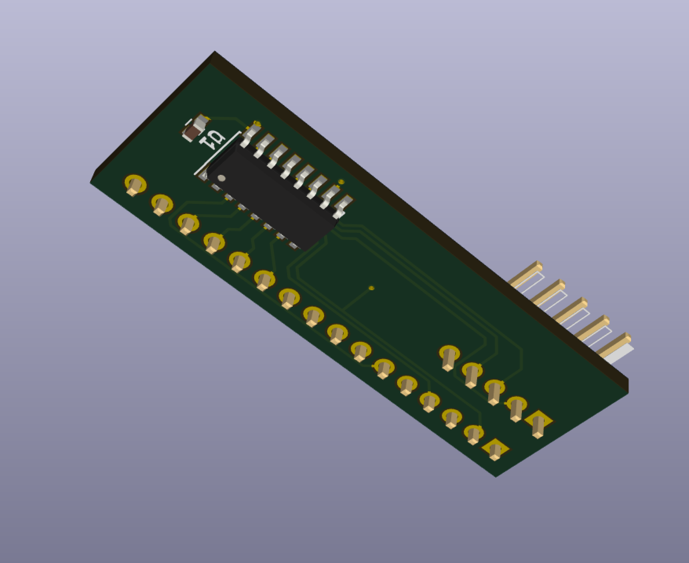
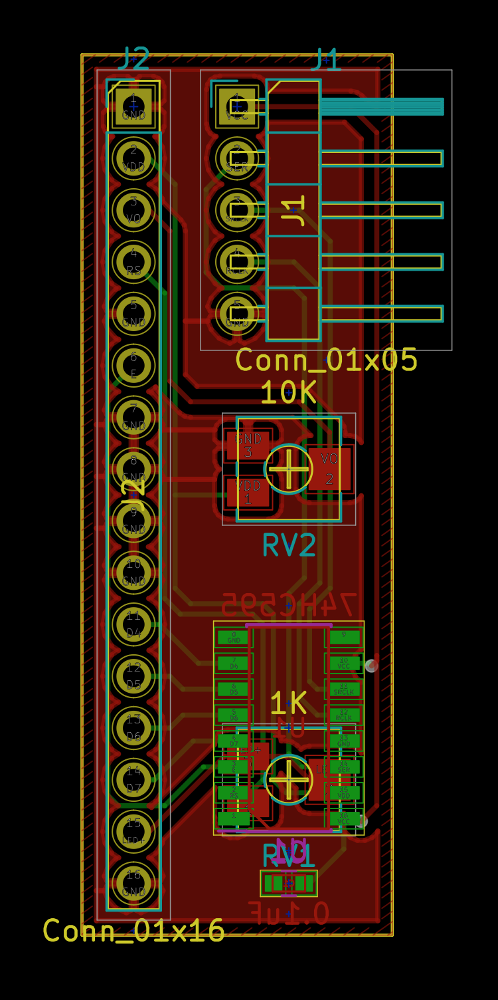

# LCD driven by a 74HC595

* Using the 4 bit mode of the standard HD44780 type LCD controller.


# Theory
* 4 data pins
* RS pin
* E pin
* Variable resistor to adjust contrast.
* Backlight control pin. Optional variable resistor to adjust brightness.
* Power pin

Which is a lot less pins than just using the pins on the device.

We can use software to turn the display off entirely.

There is an initialization chatter that we need to do to set up the display.

This hardware is write-only. We can not read from the LCD in this configuration.


# Operation

All we want to do here is write bits to the LCD.

Where we do this, according to the data sheet,
* Load the value of the data onto the data pins.
* LCD_E is LOW by default. We strobe it to HIGH to make read/write operations. The effect is applied on the *falling* edge of E signal.
* LCD RS is LOW for command operation, HIGH for data operation.



(Wavedrom source for image above)
```
{signal: [
  {name: 'RS', wave: 'x2...x'},
  {name: 'R/W', wave: '20...2'},
  {name: 'E', wave: '0.1.0.'},
  {name: 'DB7-0', wave: '2..2.2', data: ['','Valid Data']}
]}
```

Where for 4 bit operation,
* Load the upper nibble of the data or command byte to the [D4..D7] pins.
* Strobe `E` pin.
* Load the lower nibble of the data or command byte to the [D4..D7] pins.
* Strobe 'E' pin.


## Pin mapping

| 74HC595  | Display  |
|----------|:---------|
| Q7 | D4 |
| Q6 | D5 |
| Q5 | D6 |
| Q4 | D7 |
| Q3 | E |
| Q2 | RS |
| Q1 | Backlight |
| Q0 | LCD VDD |

This works out well, so that we can use shift out with the least significant bit first,
```
shiftOut(lcd->pin_ser, lcd->pin_srclk, LSBFIRST, lcd->data);
```
so in our software if we wanted to write, e.g. a `0x03`, it will be the value on [D4..D7] as it should be.

However, because the data pins are the last bits (higher number) in the shift register,
and the control pins are also in this 8 bit register, the lower down, the data when we view the waveform appears backwards.


Where we can see in the frame ther, the `3B` and then '3C' value, corresponds to
the activity of writing the value `0x0C` to the display, where we have the `E` pin first high,
and then low.

The timing diagram above only shows one nibble, or half of a character or command sequence.

### A Use case: Clearing the screen

Lets have a look at the operations that are involved by a single command.



The library provides  a function to clear the display, `void lcd_clear(serial_lcd *lcd)`:
```
void lcd_clear(serial_lcd *lcd) {
  lcd_write(lcd, 0, 0x01);
  delay(2);
}
```

Where lcd_write invokes two nibble write operations. But we have refactored the lcd_write_nibble to remove one cycle of loading the shift register.
So this is now done in 5 cycles. The original was 8.


(Where this low level port write is just digitalWrite and shiftOut opertions):
```
void lcd_port_write(serial_lcd *lcd) {
  shiftOut(lcd->pin_ser, lcd->pin_srclk, LSBFIRST, lcd->data);
  digitalWrite(lcd->pin_rclk, HIGH);
  digitalWrite(lcd->pin_rclk, LOW);
}
```

### A note about 8 bit parallel mode
Here we are using the 4 bit parallel mode, because it requires fewer pins from the shift register. We require at least of 2 control pins, so if we used 8 bit data mode we
would need 2 shift registers to get at least 10 bits.

But when we operate the display in 8 bit mode we just send out the value on the 8 pins and strobe `E` once. So there is perhaps a compelling reason to use 8 bit mode if we wanted to save some timing requirements.

Measurement in my implementation, the time required to write one nibble is about 275 microseconds. So an entire command byte is then the order of 550 microseconds.  
In my application this is fine. The LCD display has a hysteresis effect, so updating or moving characters faster appear to be blurry anyway.

# Software Features
I created a structure to hold the state for a given LCD
```
struct serial_lcd {
    int pin_ser;        // the pin number on the Arduino that connects to SER (pin 14 of the 74HC595)
    int pin_srclk;      // the pin number on the Arduino that connects to the SRCLK (pin 11 on the 74HC595)
    int pin_rclk;       // the pin number on the Arduino that connects to the RCLK (pin 12 on the 74HC595)
    volatile int data;  // the byte value representing the pin state on the 74HC595
};
```

This allows us to have more than one LCD attached to the Arduino and in use at the same time.

This does require initialization at start up. Where we need to define an instance of this and set the properties for pin_ser, pin_srclk, and pin_rclk before we can use this.

Then all the functions (see ser_595_lcd.h) require a pointer to this serial_lcd structure.

The data property should generally not be mutated by your application. This represents the state that is written on the pins of the 74HC595. The functions update various bits as required to manipulate the control pins (like `E` and `RS`) as required. They also contain the bit mapping for the power, backlight, and the [D4..D7] data bus pins into the display.

See the table above.

All functions in the libary have the sensible prefix `lcd_`. Hopefully to not collide with functions in your Sketch or other Arduino libraries that happen to be in use.  

There is no reason you could not also use the Adafruit LCD library at the same time, for example.

## Example Sketch
Have a look in the examples folder for sample use of the library.

* display_text : Prints "Hello" and moves the text back and forth on the screen.  Here I have a 20x4 LCD, so I assume there are 20 visible columns on the display.

# Hardware

A Kicad project for a circuit board to hold the 74HC595 shift register and the trimmer resistors is in the `backpack` sub folder here.




My board design is on OSHPark here: https://oshpark.com/projects/P1p8G9Nj


# Why
I have and appreciate the I2C LCD backpack. But sometimes I am playing with ATTiny devices,
or something else that does ot have an I2C. I guess I could use the SPI mode on that.

But then sometimes I don't feel like spending $10 USD, which when converted to CDN, plus taxes and shipping
usually comes out to about double.

There are a lot of low price LCD backpacks on Amazon, or AliExpress.
But then I am impatient and don't have them at the moment when I feel like wiring something up on a breadboard,
and it turns out I do have a bunch of 74HC595's. So there is that.

I also thought it is a good learning experience to build something yourself sometimes.
